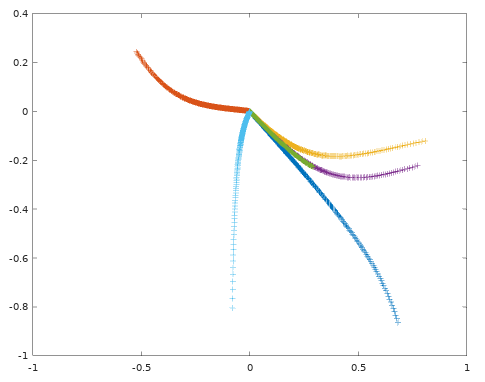
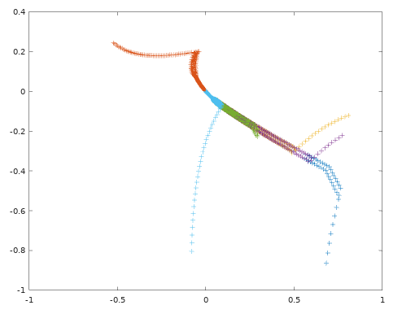

TP2 - Anticipation et commande prédictive
====

### Auteurs du CR
Zhi Zhou, <zhi.zhou@ensta-paris.fr>
 Simon Queyrut,  <simon.queyrut@ensta-paris.fr>
 
 [@zroykhi](https://github.com/zroykhi), [@queyrusi][github] 

[github]: http://github.com/queyrusi

Résumé de cours
----
Le **modèle dynamique** permet de prendre en compte des forces et, par intégration, **prédire** *des* futurs d'un système (prennant en compte des **contraintes**) et ainsi anticiper des séquences de commandes minimisant un **coût**. Le modèle le plus courant est le **NMPC**. L'**horizon** de ces prédictions pourrait être approchée par essais. Plusieurs algorithmes (linéarisation, discrétisation) permettent de simplifier, stabiliser et optimiser ces problèmes de commande. 


Description du TP
---
Sous Matlab (Octave), nous constatons les effets de la taille de l'horizon d'anticipation dans le suivi d'une trajectoire. Nous calculons ensuite la zone de stabilité pour la commande prédictive d'un bicyle et testons une de ces commandes prédictives.


Résultats
----
**Question 1**  
+ En réglant la taille de l'horizon pour l'anticipation de la commande, nous constatons que pour de petites valeurs, le bicycle anticipe correctement sa trajectoire et fluidifie ses virages comme le ferait une personne suivant une route (et cela se rapproche de ce qu'on obtenait avec PID)
+ De plus grandes valeur d'horizon (~20) conduisent à une trop grande anticipation et on voit que le robot veut finir au plus vite sa course quitte à négliger le suivi de la trajectoire (figure ci-dessous)


+ Pour des valeurs très grandes (~1000), le robot voit l'ensemble du trajet et triche en prenant presque la ligne droite vers lobjectif tout près de lui (figure ci-dessous)


| Horizon  | 1 | 5 | 20|100|1000|
| :---------: |:---------:| :-----:| :-----:|:-----:|:-----:|
|  **Erreur** | 867.1894 | 865.9341 |1014.9327|2405.0702|1687.9893

Nous constatons un problème dans la définition de l'erreur pour le suivi de trajectoire puisqu'elle devrait être maximale dans le dernier cas (complète négligence de la contrainte de suivi).

--------------
**Question 2**

Dans cette question nous étudions la stabilité pour le système défini par les équations

`$\dot{x}_{1}=x_{2}+u\left(\mu+(1-\mu) x_{1}\right) \quad \dot{x}_{2}=x_{1}+u\left(\mu-4(1-\mu) x_{2}\right).$`

Nous écrivons les matrices jacobiennes pour linéariser le système

`$A=\left[\frac{\partial \dot{x}_{i}}{\partial x_{j}}\right]=\left[\begin{array}{cc}{u(1-\mu)} & {1} \\ {1} & {-4 u(1-\mu)}\end{array}\right]$`


`$B = \left[
\frac{\partial \dot{x}_{i}}{\partial u}
\right]
= \begin{bmatrix}
\mu + (1-\mu)x_{1}\\ 
\mu - 4(1-\mu)x_{2}
\end{bmatrix}$`

que nous implémentons dans `verif_stability.m`. 
+ L'utilisation de la fonction `care` permet de retourner la solution de l'équation de Riccati :
 ```matlab
 [x, l, g] = care(A, B, Q, R);
 K=-g; 
 ```
 et ainsi trouver une relation localement stabilisante $u=Kx$ pour le contrôle par retour d'état.
+ L'équation du système avec rebouclage est donnée par $A_{K}=A+B K$ et nous l'implémentons de cette même manière dans le script.
+ Avec `lambda=max(eigs(Ak))` nous obtenons la plus grande valeur propre et elle correspond effectivement à celle de l'article : `$\lambda_{\max }\left(A_{K}\right)=-1.0$`. 
+ Nous choisissons avec ce `$\lambda$` une valeur de `$\alpha$` qui servira pour la résolution de l'équation de Lyapunov :
```
  Al=(Ak+[alpha, 0;0, alpha])';
  Bl=(Q+K'*R*K);
  P=lyap(Al,Bl);
```
et nous avons à présent ce que nous voulons, `P`.
+ Enfin nous trouvons $\beta_{1}$ la borne de la région de satisfaction des contraintes en utilisant la fonciton `qp` du package `control`.
+ Un point vérifie la stabilité si elle est dans la zone définie par $$\Omega_{1}=\left\{x \in \mathbb{R}^{n} | x^{T} P x \leq \beta_{1}\right\}$$ et c'est ce qu'on vérifie par 
```
test = x_verif' * P * x_verif;
ok = (test < beta);
```


-------------------
**Question 3** : 

1. Dans la question 2, nous avons obtenu `K = [-2.118, -2.118]`, et nous l'utilisons dans le script `test_mpc.m`. Le résultat est comme ci-dessous



La courbe est très lisse. `K` fonctionne bien ici.

2. Après avoir terminé le code, nous avons testé le `test_mpc.m` avec commande prédictive. Le résultat est comme ci-dessous.



Commande prédictive fonctionne également.