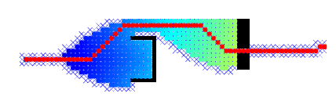
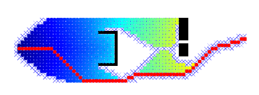

TP3 
====

### Auteurs du CR
Zhi Zhou, <zhi.zhou@ensta-paris.fr>
 Simon Queyrut,  <simon.queyrut@ensta-paris.fr>
 
 [@zroykhi](https://github.com/zroykhi), [@queyrusi][github] 

[github]: http://github.com/queyrusi

Résumé de cours
----
La planification de trajectoire numérique requiert une interprétation de l'espace réel en cartes topologiques ou métriques. 
Ces dernières appellent à la recherche d'un espace des configurations (on regarde alors la forme du robot, les contraintes d'holonomies) 
discrétisé en cellules (régulières, trees) ou chemins (diagramme de Voronoi, treillis avec échantillonage aléaoire). L'obtention 
d'un graphe permet de faire de la recherche de chemin dans un graphe avec des algorithmes (Dijkstra, Wavefront) éventuellement informés 
(A\*) supportant la replanification (D\* Lite). Les nœuds d'un graphe peuvent avoir un poids sous une politique.

Description du TP
---
Nous utilisons l'agorithme A* sans (Dijstra) et avec heuristique dont nous faisons varier l'intensité pour constater les paramètres les plus adaptés pour atteindre l'objectif. Nous modifions le poids des nœuds afin de garder une distance aux obstacles (politique) que nous générons aussi aléatoirement.

Question 1
-----
Nous détaillons le module `Astar.m` (hors plot).

La discrétisation de la carte `MAP` est détaillée dans `xmax` et `ymax` et la position de départ du robot dans `start` et `goal`. Les obstacles sont fixés dans l'array `MAP` (poids infini). 
La boucle commençant à la ligne 55 initialise les matrices de coût `H` (*heuristique* ou distance au but) et `G` (distance au départ). On initialise juste après la matrice des coûts `F` comme étant la somme pour chaque nœud du `G` et du `H` (pour le premier nœud, c'est juste `H` à la position de `start`).

Après l'initialisation (on ajoute le nœud de départ aux nœuds ouverts `openNodes`), on commence une boucle ligne 87 qui ne se termine que lorsque la liste des nœuds ouverts est non-vide. Le nœud `current` est le nœud avec la F-valeur la plus basse ; si ce nœud courant est le nœud objectif `goal`, on ajoute le courant à la liste et un chemin a été trouvé : l'algorithme termine. Sinon, on déplace le nœud courant depuis la liste des nœuds ouverts vers la liste des fermés. 

Ensuite, on boucle sur chaque voisin du nœud courant. Si ce voisin est hors de portée, ou est le `current`, ou est imperméable (obstacle), ou est dans la liste des fermés, alors on passe au voisin suivant (`skip`). En arrivant à un voisin qui n'a pas été "skipé" : si ce voisin n'est pas dans la liste des ouverts, on l'y ajoute. De plus, si ce voisin vérifie un chemin plus court, on calcule un nouveau coût F pour ce voisin `newF` et on lui renseigne son parent (`cameFrom`).

Question 2
-----
Avec le paramètre `weight=0`, l’algorithme exécuté est **Dijkstra**. Tous les points de l'ensemble *open set* ont la même valeur H, qui est zéro. L'algorithme ne considère que le coût du point actuel au point de départ, identique à Dijkstra.

Question 3
-----

| weigth | time(s) | path length |
|:------:|:-------:|:-----------:|
|   1    | 32.9615 | 74.5563     |
|   3    | 5.22221 | 78.0711     |
|   1.4  | 5.48955 | 74.5563     |

Pour `weight = 1`, le temps d'exécution est le plus long, mais il génère correctement le chemin le plus court. Pour `weight = 5`, le temps d'exécution est le plus court mais le chemin trouvé n'est pas le plus court. Pour `weight = 1.4`, le temps d'exécution est très proche de `weight = 5`, et il a calculé correctement le chemin le plus court. On voit que `weight = 1.4` est le plus adapté.

Question 4
-----
nous remplaçons `W = zeros(size(MAP));` par `W = 1 ./ bwdist(MAP);`. Le résultat que nous avons obtenu est indiqué ci-dessous:

Si nous continuons à augmenter le coefficient de W, comme `W = 2 ./ bwdist(MAP);`, nous obtiendrons le résultat suivant

Nous pouvons voir que le robot garde une certaine distance des obstacles, ce qui est différent du résultat précédent. Les points près des obstacles ou des routes étroites ont tendance à avoir une valeur F plus élevée, de sorte que le robot essaiera d'éviter ces points.

Question 5
-----
Avec `weight = 1.4`

| num of obstacle | 2       | 4        |    6     |     8    |    10    |
|:---------------:|:-------:|:--------:|:--------:|:--------:|:--------:|
|   time(s)       | 13.9116 |  12.3262 |  18.389  |   14.7054| 22.1382  |
|   path length   | 77.0416 | 77.8701  | 76.2132  |  77.8701 | 78.6985  |

Avec `weight = 0`

| num of obstacle | 2       | 4        |    6     |     8    |    10    |
|:---------------:|:-------:|:--------:|:--------:|:--------:|:--------:|
|   time(s)       | 89.5443 |  88.5958 | 85.0317  |   85.2491| 83.0913  |
|   path length   | 79.5269 | 79.5269  | 77.0416  |  79.5269 | 79.5269  |

En général, avec `weight = 1.4`, le temps d'exécution est plus court qu'avec `weight = 0`. Avec `weight = 1.4`, l'algorithme prend le coût de la distance entre le point actuel et le point cible. plus le point est éloigné du point cible, plus le coût est élevé. Ainsi, à chaque itération, l'algorithme a tendance à choisir les points les plus proches de la cible, ce qui augmente la vitesse de recherche de la solution.
